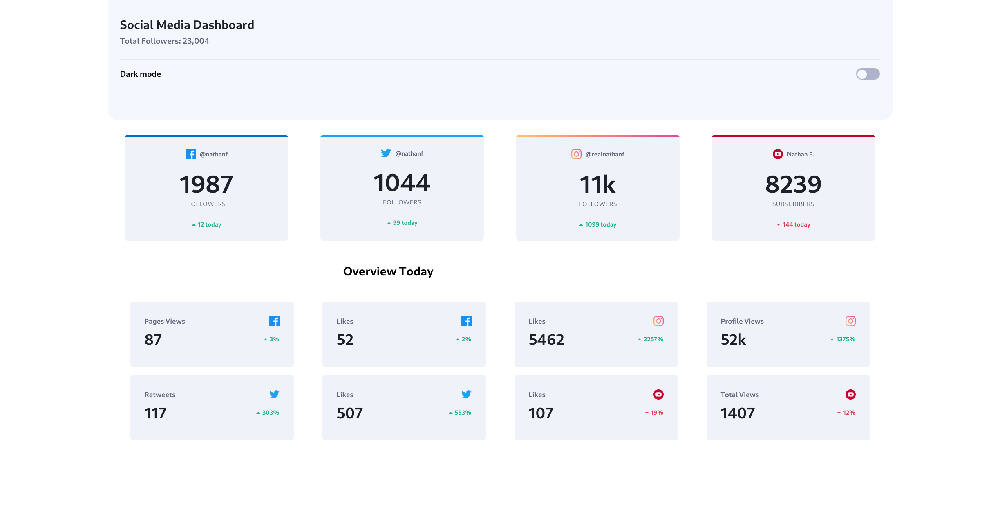

<h1 align="center">Frontend Mentor
  
   

 
</h1>
<h1 align="center">Social media dashboard with theme switcher</h1>

 

<!---

  
  
  
  

---> 
## Project description: 

The challenge is to build out this landing page.

The only JavaScript used is for the color theme toggle.

Your users should be able to:

- Toggle color theme to their preference
- View the optimal layout for the interface depending on their device's screen size
- See hover and focus states for all interactive elements on the page

## Technology Used ✨

 

## Preview

##  See project online 

[Link to project](https://codepen.io/Robeloper/full/ZEPRzZx) ✨

 

## Author

👤 **Roberto PEREZ**

<!--- 
* [Website](https://pejir.github.io/robertoportfolio.io/ )
* [Twitter](https://twitter.com/pejir)--->
* [Github](https://github.com/pejir)
* [LinkedIn](https://linkedin.com/in/pejir)

<!---
## 🤝 Contributing

Contributions, issues and feature requests are welcome! Feel free to check [issues page](pejir). You can also take a look at the [contributing guide](pejir).
---> 
 
## Show your support

Give a ⭐️ if this project helped you!

<!---

--->

## 📝 License

Copyright © 2023 [Roberto Perez](https://github.com/PeJiR). 
This project is [MIT](https://opensource.org/license/mit/) licensed.

P.S.
------------

Please drop me an note with any feedback you have.

**Roberto Perez**
